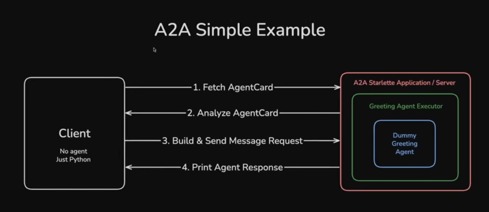

# A2A Agent

This repository contains code for implementing the Agent-to-Agent (A2A) protocol. The A2A protocol enables secure, decentralized communication between autonomous agents, commonly used in decentralized identity and verifiable credential ecosystems.




## Features

- Modular agent architecture
- Example agents for math operations and web search
- Agent executor for managing agent interactions
- Sample client for testing agent communication

## Project Structure

```
a2a_sample/
    agent_executor.py      # Core logic for executing agent tasks
    test_client.py         # Sample client for testing A2A interactions
    __main__.py            # Entry point for running the sample
agents/
    maths_agent.py         # Math operations agent
    websearch_agent.py     # Web search agent
main.py                   # Main entry point
requirements.txt          # Python dependencies
pyproject.toml            # Project metadata
```

## Getting Started

1. **Install dependencies:**
   ```bash
   pip install -r requirements.txt
   ```

2. **Run the sample agent:**
   ```bash
   python main.py
   ```

3. **Test agent communication:**
   ```bash
   python -m a2a_sample.test_client
   ```

## Usage

- Extend the `agents/` directory to add new agent types.
- Use `a2a_sample/agent_executor.py` to manage agent lifecycles and message routing.

## Contributing

Contributions are welcome! Please open issues or submit pull requests for improvements.

## License

This project is licensed under the MIT License.
